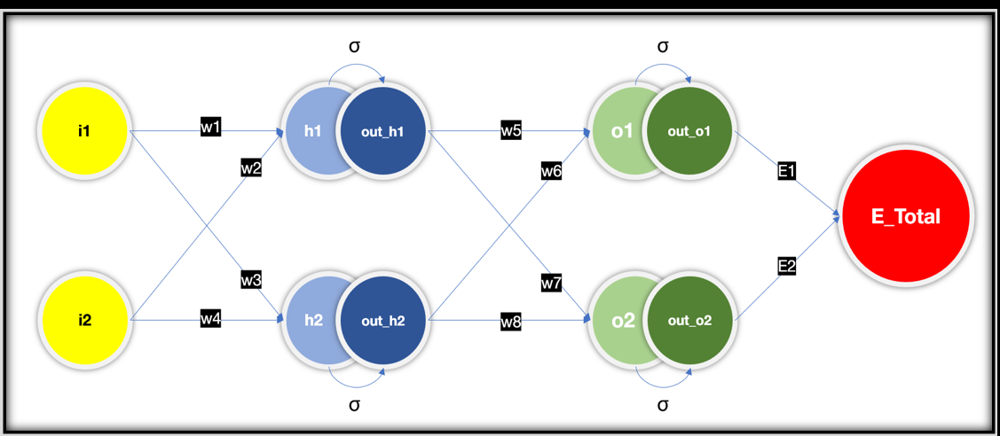
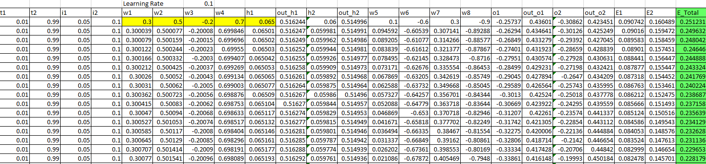
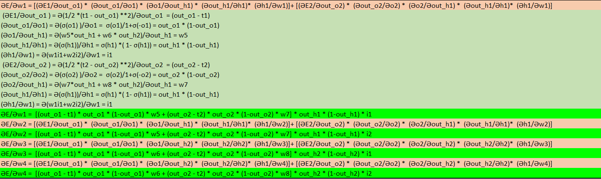

# Part1 - Training A Neural Network and Explaining BackPropagation

Explanation 
================

Task here to  train a neural network model from scratch. We have taken a simple network to show different steps of training including back propagation. 
This excels sheet take us through step by step forward propagation and back propagation steps of the network.
Let’s look at the diagram below and discuss over it.

All the different parameters/variables/functions  
===============================

- Two Input neurons (i1, i2)
- One hidden layer of size 2 (h1, h2)
- Sigmoid Activation function on hidden layers (out_h1, out_h2)
- One output layer (O1, O2)
- Sigmoid Activation Function on Output (out_O1, out_O2)
- Target (t1, t2)
- Error Total (Total = E1 + E2)
- Weights (w1,w2 ………, w8)

Forward Propagation
======================

- h1=w1i1+w2i2	 	 	 
- out_h1 = σ(h1) = σ(w1i1+w2i2)	 	 
- h2=w3i1+w4i2	 	 	 
- out_h2 = σ(h2) = σ(w3i1+w4i2)	 	 
 	 	 	 	 
- o1 = w5*out_h1 + w6 * out_h2	 	 
- out_o1 = σ(o1) = σ(w5*out_h1 + w6 * out_h2)
- o2 = w7*out_h1 + w8 * out_h2	 	 
- out_o2 = σ(o2) = σ(w7*out_h1 + w8 * out_h2)
 	 	 	 	 
- E_Total = E1 + E2	 	 	 
- E1 = 1/2 *(t1 - out_o1) **2	 	 
- E2 = 1/2 *(t2 - out_o2) **2	 	 
 	 	 	 	 

We have considered Mean Square Error (MSE) loss. 

Back Propagation Steps 
==========================

The first step while performing back propagation is to take the partial derivative w.r.t the weights near to the output layer (W5, W6, W7, W8)

- ӘE/Әw5 = (ӘE1+ӘE2)/Әw5 = ӘE1/Әw5= (ӘE1/Әout_o1 ) * (Әout_o1/Әo1)*(Әo1/Әw5) 

Error 2 Does not propagate through w5. Hence ӘE/Әw5 = (ӘE1+ӘE2)/Әw5 = ӘE1/Әw5

- Based on chain rule;

    - ӘE1/Әw5= (ӘE1/Әout_o1) * (Әout_o1/Әo1) *(Әo1/Әw5)

    - (ӘE1/Әout_o1 ) = Ә(1/2 *(t1 - out_o1) **2)/Әout_o1  = (out_o1 - t1)

    - (Әout_o1/Әo1) = Ә(σ(o1) )/Әo1 =  σ(o1)/1- +σ(-o1) = out_o1 * (1-out_o1)

    - (Әo1/Әw5) = Ә(w5*out_h1 + w6 * out_h2)/Әw5 = out_h1

So, putting it altogether;

    - ӘE/Әw5 = (out_o1 - t1) * out_o1 * (1-out_o1) * out_h1

Similarly w6 will not have any impact of E2 ; 

    - ӘE/Әw6 = (out_o1 - t1) * out_o1 *(1-out_o1) * out_h2

W7 & w8 will not have any impact of E1 

    - ӘE/Әw7 = (out_o2 - t2) * out_o2 *(1-out_o2) * out_h1

    - ӘE/Әw8 = (out_o2 - t2) * out_o2*(1-out_o2) * out_h2

Now let’s Look into other weights w1,w2,w3,w4 

Based on chain rule ;

ӘE/Әw1 = [(ӘE1/Әout_o1) *  (Әout_o1/Әo1) *  (Әo1/Әout_h1) *  (Әout_h1/Әh1)*  (Әh1/Әw1)]+ [(ӘE2/Әout_o2) *  (Әout_o2/Әo2) *  (Әo2/Әout_h1) *  (Әout_h1/Әh1)*  (Әh1/Әw1)]

    1.	(ӘE1/Әout_o1 ) = Ә(1/2 *(t1 - out_o1) **2)/Әout_o1  = (out_o1 - t1)
    2.	(Әout_o1/Әo1) = Ә(σ(o1) )/Әo1 =  σ(o1)/1+σ(-o1) = out_o1 * (1-out_o1)
    3.	(Әo1/Әout_h1) = Ә(w5*out_h1 + w6 * out_h2)/Әout_h1 = w5
    4.	(Әout_h1/Әh1) = Ә(σ(h1))/Әh1 = σ(h1) *( 1- σ(h1)) = out_h1 * (1-out_h1)
    5.	(Әh1/Әw1) = Ә(w1i1+w2i2)/Әw1 = i1
    6.	(ӘE2/Әout_o2 ) = Ә(1/2 *(t2 - out_o2) **2)/Әout_o2  = (out_o2 - t2)
    7.	(Әout_o2/Әo2) = Ә(σ(o2) )/Әo2 =  σ(o2)/1+σ(-o2) = out_o2 * (1-out_o2)
    8.	(Әo2/Әout_h1) = Ә(w7*out_h1 + w8 * out_h2)/Әout_h1 = w7
    9.	(Әout_h1/Әh1) = Ә(σ(h1))/Әh1 = σ(h1) *( 1- σ(h1)) = out_h1 * (1-out_h1)
    10.	(Әh1/Әw1) = Ә(w1i1+w2i2)/Әw1 = i1

Putting it altogether we got 

    ӘE/Әw1 =  [(out_o1 - t1) * out_o1 * (1-out_o1) * w5 + (out_o2 - t2) * out_o2 * (1-out_o2) * w7] * out_h1 * (1-out_h1) * i1

    Similarly ;
    ӘE/Әw2 =  [(out_o1 - t1) * out_o1 * (1-out_o1) * w5 + (out_o2 - t2) * out_o2 * (1-out_o2) * w7] * out_h1 * (1-out_h1) * i2

    ӘE/Әw3 =  [(out_o1 - t1) * out_o1 * (1-out_o1) * w6 + (out_o2 - t2) * out_o2 * (1-out_o2) * w8] * out_h2 * (1-out_h2) * i1
    
    ӘE/Әw4 =  [(out_o1 - t1) * out_o1 * (1-out_o1) * w6 + (out_o2 - t2) * out_o2 * (1-out_o2) * w8] * out_h2 * (1-out_h2) * i2

Now let’s put all in tabular format, do simple mathematics 

We performed this training for multiple learning rates (0.1, 0.2, 0.5, 0.8, 1.0, 2.0) keeping the initial weights same. This shows the impact of learning rate over training 
Each cell of the attached excel sheet shows the formula of back propagation which is 

Here we haven’t considered bias.

Loss Curve comparison based on learning rate 
=================================================

All the above steps are used to train a Neural Network from scratch.Pytorch uses dynamic graph to store the gradients and that way it's much easier than solving through the analytical way we tried to solve 

# Part2 - Image Classification Application

This application is designed for image classification using a convolutional neural network. The images used for classification have a size of 28x28 pixels with 1 channel are from the MNIST dataset.There are 10 classes to classify.

The plan was to bring the test accuracy to more than 99.4 percent within 20 K parameters and 20 epoch. The solution crosses 99.4 in 15th epoch and the final accuracy is 99.44.
To achieve this i need to redesign the model architecture and also added rotational transformation to it. I did not use padding as when i visualize the image i did not see any portion of the images in edge  
## Files

- `model.py`: This file contains the architecture of the convolutional neural network model used for image classification. It defines the structure of the model and the forward propagation method.
You can instantiate the Model by importing the Net Class from the model module.
`from model import Net`
This also includes training and test functions which takes care of the training and testing of the model. More information about the parameters of these functions have been provided in the descriptions of the functions 
 
- `utility.py`: This file contains utility functions on the accuracy of the prediction`GetCorrectPredCount`and `display_model_summary` which are used displaying the model summary. You 
- `SP_S6.ipynb`: This Jupyter Notebook contains the main code to run the application. It imports model architecture from `model.py` and use the utility functions from `utility.py` to train and test the model. It also displays the train and test loss through graph 

## Instructions

To use this application, follow these steps:

1. Install the required dependencies (PyTorch, tqdm, etc.).
2. Import the `model.py` file to access the model architecture.
3. Import the utility functions from `utils.py` to perform training, testing, and accuracy calculations.
4. Run the code in `SP_S6.ipynb` to train and test the model on your dataset.

## Additional Notes

- Make sure your dataset is prepared and formatted correctly before running the application.
- Adjust the hyperparameters and model architecture in `model.py` and the training/testing procedures in `SP_S6.ipynb` as per your specific requirements.
- For more detailed information, refer to the code comments within each file.
