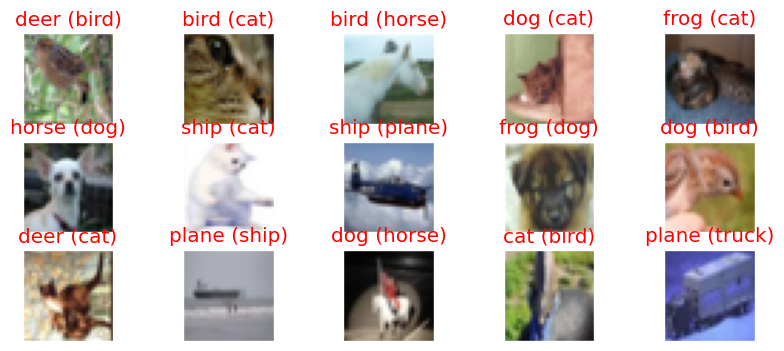

# Image Classification Application for CIFAR10 dataset

This application is designed for image classification using a convolutional neural network. The images used for classification have a size of 32x32 pixels with 3 channel are from the CIFAR10 dataset.There are 10 classes to classify from plane,car,bird,cat,deer,dog,frog,horse,ship,truck.
This application has the below architecture -
    C1 C2 T3 P1 C3 C4 C5 T6 P2 C7 C8 C9 GAP C10
    Where C indicates Convolution Block ,while T indicates transition block ,P indicates Pooling Layer and GAP is Global Average Layer.

    We have been asked to achieve more than 70% accuracy with less than 50 K parameters and in 20 epochs.

## Files

- `model.py`: This file contains the architecture of the convolutional neural network model used for image classification. It defines the structure of the model and the forward propagation method.
- `utils.py`: This file contains utility functions for training, testing, and calculating accuracy. 
- `SP- S8_v3_BatchNorm.ipynb`: This Jupyter Notebook contains the main code to run the application for the batch normalizatoin . It demonstrates how to import the model architecture and training class from `model.py`

## Instructions

To use this application, follow these steps:

1. Install the required dependencies (PyTorch ).
2. Import the `model.py` file to access the model architecture,training, testing
3. Run the code in `S5_SP.ipynb` to train and test the model on your dataset.

## Additional Notes

- what is your code all about ?
-   I have three models and three jupyter note books depicting Batch Normalization,Group Normalization and Layer Normalization
-   ## Batch Normalization
-  Name of the file
-    `SP- S8_v3_BatchNorm.ipynb` -
-    Name of the model architecture NetBatchNorm present in the `model.py`
-    I was able to achieve more than 70% accuracy in 10 epoch with 47876 parameters
-    Without Batch Normalization the model was struggling to achieve same accuracy
-    11th Epoch : training loss: 0.2039, acc 71.31%  validation loss: 0.1946, validation acc 72.91% 
-    Added One cycle LR to change the learning rate and i found it to be very effective
  
   ## Group Normalization
-   Name of the File
-   `
