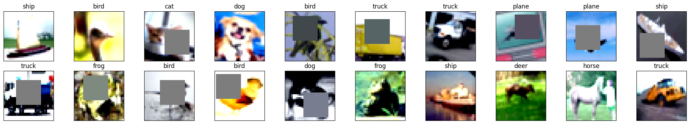
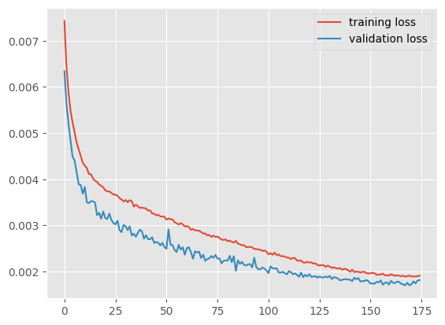
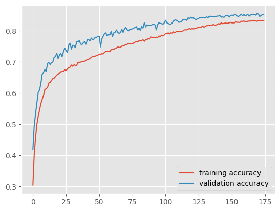
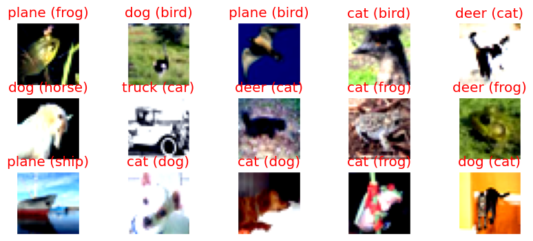

# Image Classification Application for CIFAR10 dataset

This application is designed for image classification using a convolutional neural network. The images used for classification have a size of 32x32 pixels with 3 channel are from the CIFAR10 dataset.There are 10 classes to classify from plane,car,bird,cat,deer,dog,frog,horse,ship,truck.
# Below are the constraints
  - Architecture should be in the format of  C1C2C3C40 (No MaxPooling, but 3 convolutions, where the last one has a stride of 2 instead) 
  - total RF must be more than 44
  - one of the layers must use Depthwise Separable Convolution
  - one of the layers must use Dilated Convolution
  - use GAP (compulsory):- add FC after GAP to target #of classes (optional)
  - use albumentation library and apply:
  - horizontal flip
  - shiftScaleRotate
  - coarseDropout (max_holes = 1, max_height=16px, max_width=16, min_holes = 1, min_height=16px, min_width=16px, fill_value=(mean of your dataset), mask_fill_value = None)
  - achieve 85% accuracy, as many epochs as you want. Total Params to be less than 200k.

# Results 
  - Achieved more than 85% accuracy with less than 200 K parameters(195508)
  - Number of Epochs to achieve is less than 175
  - Applied depth-wise separable convolution
  - Applied dialated convolution
  - Applied GAP   

## Files

- `model.py`: This file contains the architecture of the convolutional neural network model used for image classification. It defines the structure of the model and the forward propagation method . Class Name of the CNN model is `NetDilated`
- `SP- S9_v1.ipynb`: This Jupyter Notebook contains the main code to run the application for the batch normalizatoin . It demonstrates how to import the model architecture and training class from `model.py`
- `dataset.py` : This module has a class that loads the cifar10 data and apply necessary transformation. The DataTransformation class helps to apply the necessary image augmentation using albumentation 
- `utils.py`: This file contains all the utility funtions

## Additional Notes

### Dilated Convolution:
It is a technique that expands the kernel (input) by inserting holes between its consecutive elements. In simpler terms, it is the same as convolution but it involves pixel skipping, so as to cover a larger area of the input.
In summary dilated convolution is a powerful technique for increasing the receptive field and capturing multi-scale contextual information in convolutional neural networks. It provides a balance between the receptive field size and computational efficiency, making it suitable for various computer vision tasks where capturing global context is important

### Depth-wise separable convolution:
is a type of convolutional operation commonly used in deep learning architectures, especially in mobile and resource-constrained applications. It decomposes the standard convolutional operation into two separate layers: depth-wise convolution and point-wise convolution.

  1. Depth-wise convolution: In this step, each input channel is convolved with its own set of filters independently. This means that each channel is processed individually without any interaction with other channels. Depth-wise convolution helps capture spatial information within each channel while keeping the computational cost relatively low.
  
  2. Point-wise convolution: In this step, a 1x1 convolution is applied to the output of the depth-wise convolution. This operation performs a linear combination of the channel-wise features, allowing cross-channel interactions and enabling the network to learn more complex representations.
  
  The main advantage of depth-wise separable convolution is its computational efficiency compared to standard convolutions. By decoupling the depth-wise and point-wise operations, the number of parameters and computations is significantly reduced. This reduction in parameters makes the model more lightweight and requires less memory and processing power, making it suitable for mobile and embedded devices.
  
  Additionally, depth-wise separable convolution can improve the model's performance by enhancing its ability to capture spatial information within each channel independently. This is particularly beneficial when dealing with small or limited datasets, as it reduces the risk of overfitting by reducing the model's capacity to memorize specific examples.
  
  However, depth-wise separable convolution may have limitations in scenarios where capturing complex interactions between channels is crucial. Since the depth-wise convolution operates independently on each channel, it may not be able to effectively capture cross-channel dependencies compared to standard convolutions.

Overall, depth-wise separable convolution offers a trade-off between computational efficiency and representation power, making it a useful tool for optimizing convolutional neural network architectures in resource-constrained scenarios.

 ### Image Augmentation
 Snapshot after applying augmentation
  

  ### Loss Graph
  

  ### Accuracy Graph
  

  
  ### Wrongly Classified Predictation 
  

